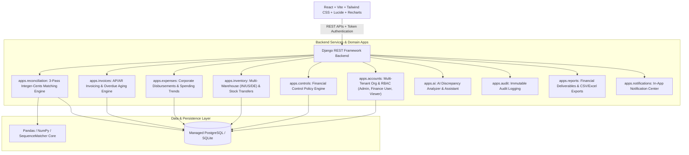

# FinSight — Enterprise Finance Operations & Intelligent Reconciliation Platform

FinSight is a production-grade internal Finance Operations & Multi-Tenant SaaS platform designed around real-world corporate treasury, accounts payable/receivable, multi-warehouse inventory valuation, policy governance, team role-based access control (RBAC), and deterministic 3-pass bank-to-general-ledger reconciliation.

---

## 🧭 Table of Contents (Navigation)

- [1. System Architecture](#1-system-architecture)
- [2. Core Modules & Capabilities](#2-core-modules--capabilities)
  - [🏢 Multi-Tenant Organization & Team Settings](#-1-multi-tenant-organization--admin-team-settings-settings)
  - [🏦 3-Pass Bank-to-GL Reconciliation Engine](#-2-3-pass-bank-to-gl-reconciliation-engine)
  - [📄 Accounts Payable & Receivable Invoicing](#-3-accounts-payable--receivable-invoicing)
  - [💳 Corporate Expense Management](#-4-corporate-expense-management)
  - [🏭 Multi-Warehouse Inventory Tracking](#-5-multi-warehouse-inventory-tracking)
  - [🛡️ Financial Control Policy Engine](#-6-financial-control-policy-engine)
  - [🤖 AI Finance Assistant](#-7-ai-finance-assistant)
  - [📜 Audit Trail & Financial Reporting](#-8-audit-trail--financial-reporting)
- [3. Tech Stack](#3-tech-stack)
- [4. Setup & Running Instructions](#4-setup--running-instructions)
- [5. User Roles & Default Test Credentials](#5-user-roles--default-test-credentials)
- [6. Production Deployment](#6-production-deployment)
  - [Frontend on Vercel](#1-frontend-vercel)
  - [Backend & PostgreSQL on Render / Railway](#2-backend--postgresql-render--railway--aws)
- [7. Testing & Quality Assurance](#7-testing--quality-assurance)
- [8. Repository Navigation & File Map](#8-repository-navigation--file-map)
- [9. License](#9-license)

---

## 1. System Architecture



---

## 2. Core Modules & Capabilities

### 🏢 1. Multi-Tenant Organization & Admin Team Settings (`/settings`)
- **Company Self-Registration**: Company founders register and are designated as **Admin** with their own isolated `Organization` container.
- **Team Management Panel**:
  - Invite new team members with email and custom initial role.
  - Inline role promotion / demotion (`Finance User` vs `Viewer` vs `Admin`).
  - Access revocation with immutable audit logs.
- **Company Profile Settings**: Manage company legal name, tax/GSTIN identifier, and base accounting currency (`INR`, `USD`, `EUR`, `GBP`).

### 🏦 2. 3-Pass Bank-to-GL Reconciliation Engine
- **Integer-Cents Precision**: Eliminates floating-point arithmetic errors (`0.1 + 0.2 != 0.3`) by evaluating all comparisons in integer cents.
- **Pass 1 — Exact Match (100% Confidence)**: Matches same signed integer-cents amount and same date.
- **Pass 2 — Timing Match (88–98% Confidence)**: Matches identical amount clearing within a configurable timing window (±5 days).
- **Pass 3 — Tolerance + Fuzzy Match (60–88% Confidence)**: Pairs near-amounts within threshold (±₹1.00) and ±7 days with tokenized sequence similarity score $\ge 0.35$.
- **Ranked Exception Classifier**: Classifies breaks by dollar exposure, diagnosing unbooked bank fees, NSF returns, interest, deposits in transit, outstanding checks, and duplicate entries.
- **Reconciliation Proof**: Summarizes adjusted bank vs. adjusted GL balances tying to **$0.00** unreconciled difference.

### 📄 3. Accounts Payable & Receivable Invoicing
- Complete invoice lifecycle (`PENDING`, `PARTIALLY_PAID`, `PAID`, `OVERDUE`, `DISPUTED`).
- Automated days overdue counter with aging buckets (0-30, 31-60, 61-90, 90+ days).
- Partial payment recorder with real-time balance calculations.

### 💳 4. Corporate Expense Management
- Categorized operational disbursements: Travel, Software & Cloud, Logistics, Office, Inventory, Payroll, and Other.
- Recharts-powered monthly spending trend analytics and category breakdown visualizers.

### 🏭 5. Multi-Warehouse Inventory Tracking
- Multi-site inventory ledger across **India Central (`WH-INDIA`)**, **North America (`WH-USA`)**, and **Europe (`WH-GERMANY`)**.
- Atomic stock transfer execution deducting from source and crediting destination in a single database transaction.
- Real-time inventory valuation and low-stock threshold alerts.

### 🛡️ 6. Financial Control Policy Engine
- Configurable rule-based governance engine:
  - **Rule 1**: Flag outgoing payments $> ₹100,000$ for executive approval.
  - **Rule 2**: Detect duplicate vendor payments and double-posted Journal Entries.
  - **Rule 3**: Flag invoice settlement amount variances.
  - **Rule 4**: Overdue invoice alerts ($> 15$ days).
- Dedicated **Control Center** with violation review, investigation, and resolution workflows.

### 🤖 7. AI Finance Assistant
- Context-bounded financial intelligence engine providing explanations without hallucinating or making unilateral ledger modifications.
- Structured answers separating:
  1. **Observed Financial Data** (verified numbers from database/telemetry)
  2. **Possible Explanation** (accounting hypothesis & root cause analysis)
  3. **Actionable Recommendation** (recommended Journal Entries and operational steps)

### 📜 8. Audit Trail & Financial Reporting
- Immutable chronological audit trail recording user logins, CSV uploads, reconciliation runs, match approvals, invoice settlements, and team permission edits.
- Instant CSV and Excel export generators for reconciliation breaks, invoice ledgers, expense logs, and inventory valuations.

---

## 3. Tech Stack

- **Frontend**: React 19, Vite, Tailwind CSS, Lucide React, Recharts, Axios, React Router v7.
- **Backend**: Python 3.13, Django 6.1, Django REST Framework, django-cors-headers, WhiteNoise, Gunicorn.
- **Data Engine**: Pandas, NumPy, OpenPyXL, Python `difflib`.
- **Database**: PostgreSQL (Production with `dj-database-url`) & SQLite (Zero-config local development).

---

## 4. Setup & Running Instructions

### Prerequisites
- Python 3.10+
- Node.js 18+ and npm

### 1. Backend Setup
```powershell
# Navigate to project root
cd c:\web_devp_course\MERN_Projects\FinSight

# Install Python dependencies
pip install -r backend/requirements.txt

# Apply database migrations
python backend/manage.py migrate

# Seed comprehensive realistic demo data (500+ transactions, 300+ invoices, inventory, control rules)
python backend/manage.py seed_demo_data

# Run Django Backend Server
python backend/manage.py runserver 8000
```
Backend API will be accessible at: `http://localhost:8000/`

### 2. Frontend Setup
```powershell
# Open a new terminal in the frontend directory
cd c:\web_devp_course\MERN_Projects\FinSight\frontend

# Install npm packages
npm install

# Start Vite Development Server
npm run dev
```
Frontend Web App will be accessible at: `http://localhost:5173/`

---

## 5. User Roles & Default Test Credentials

| Role | Email | Password | Permissions |
|---|---|---|---|
| 👑 **Admin** | `admin@finsight.com` | `Admin@123` | Full control, manage company profile, invite team members, edit control rules |
| 💼 **Finance User** | `finance@finsight.com` | `Finance@123` | Run reconciliation, record expenses/invoices, execute warehouse stock transfers |
| 👁️ **Viewer** | `viewer@finsight.com` | `Viewer@123` | Read-only dashboards, audit logs, and financial report exports |

---

## 6. Production Deployment

### 1. Frontend (Vercel)
The repository includes `frontend/vercel.json` for seamless SPA routing.
1. Connect your repository to [Vercel](https://vercel.com).
2. Set Root Directory to `frontend`.
3. Add Environment Variable: `VITE_API_BASE_URL=https://your-backend-api.onrender.com/api`.
4. Deploy!

### 2. Backend & PostgreSQL (Render / Railway / AWS)
The repository includes `backend/Procfile` and `backend/render.yaml`.
1. Deploy as a Web Service on [Render](https://render.com) or [Railway](https://railway.app).
2. Provision a free managed PostgreSQL database.
3. Configure Environment Variables:
   - `DATABASE_URL`: Your PostgreSQL connection string.
   - `SECRET_KEY`: A secure random secret key.
   - `ALLOWED_HOSTS`: `.onrender.com,yourdomain.com`.
   - `DEBUG`: `False`.
4. Run Build Command: `pip install -r backend/requirements.txt && python backend/manage.py migrate && python backend/manage.py collectstatic --no-input`.
5. Run Start Command: `gunicorn --chdir backend config.wsgi:application --bind 0.0.0.0:$PORT`.

---

## 7. Testing & Quality Assurance

### Comprehensive End-to-End System Test (All 10 Modules)
```powershell
python backend/test_all_features.py
```

### Automated Unit & Integration Tests
```powershell
python backend/manage.py test tests
```

### Frontend Production Build Verification
```powershell
cd frontend
npm run build
```

---

## 8. Repository Navigation & File Map

```
FinSight/
├── backend/                         # Django REST Framework backend API
│   ├── apps/
│   │   ├── accounts/                # Multi-tenant Organization & RBAC models & views
│   │   ├── ai/                      # AI Discrepancy Assistant service & API
│   │   ├── audit/                   # Immutable chronological audit trail
│   │   ├── controls/                # Financial control policy engine & violations
│   │   ├── expenses/                # Corporate disbursements & spending analytics
│   │   ├── inventory/               # Multi-warehouse stock tracking & transfers
│   │   ├── invoices/                # AP/AR invoice ledgers & aging calculations
│   │   ├── notifications/           # In-app alert notification center
│   │   ├── reconciliation/          # 3-Pass integer-cents matching engine
│   │   └── reports/                 # Financial reporting overview & CSV exports
│   ├── config/                      # Django project settings & URL configuration
│   ├── Procfile                     # WSGI Gunicorn web process script
│   ├── render.yaml                  # 1-Click Render + PostgreSQL deployment blueprint
│   ├── requirements.txt             # Python production dependencies
│   └── test_all_features.py         # Automated 10-module E2E verification test suite
│
├── frontend/                        # React 19 + Vite frontend application
│   ├── src/
│   │   ├── components/              # Reusable UI cards, sidebars, modals & headers
│   │   ├── context/                 # AuthContext & NotificationContext providers
│   │   ├── pages/                   # Application pages (Dashboard, Recon, Invoices, Settings, etc.)
│   │   └── services/                # Axios API client configured with auth headers
│   ├── vercel.json                  # Vercel SPA client-side routing rewrites
│   └── vite.config.js               # Vite bundler configuration
│
├── data/                            # Raw benchmark reconciliation ledger datasets
├── output/                          # Close-ready Excel reconciliation packages
└── README.md                        # Master project documentation & system guide
```

---

## 9. License

MIT License — see [LICENSE](LICENSE).

---

## ⭐ Like this project?

If FinSight helped you learn something new, saved you time, or you just think deterministic integer-cents reconciliation is cool — **please consider giving it a star!** ⭐

It takes 1 second for you, but means the world to me. 🙏

[](https://github.com/Utkarsh1087/FinSight)

---

> *Why did the accountant break up with the calculator?*
>
> *Because they felt like they were just being **used** — and the relationship didn't **add up** anymore.* 🧮💔
>
> *Bad Joke 🤧, I knew it.*
>
> *But your smile isn't* 😊
